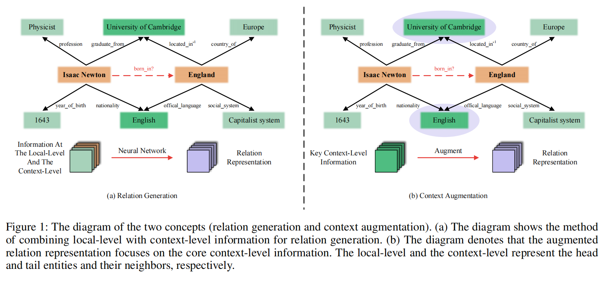

# GTA

Implementation of ["GTA: Relation Generation Then Context Augmentation for Few-Shot Knowledge Graph Completion"](https://openreview.net/forum?id=yn0880hTII&referrer=%5BAuthor%20Console%5D(%2Fgroup%3Fid%3DAAAI.org%2F2025%2FConference%2FAuthors%23your-submissions))

**Generation Then Augmentation (GTA)**, integrates the local-level and the context-level for generation then augmentation. Specifically, we employ a novel **Parameter-free Degree-based Aggregation (PDA)** method to aggregate multi-hop neighbors' information to extract abundant structural knowledge in graphs for relation generation. Then we implement **Context Augmentation (CA)** to capture key context-level information for further relation representation enhancement. Extensive experiments prove the effectiveness of **GTA**.

The figure below shows the concepts of **(1) Relation Generation; (2) Context Augmentation**



## Requirements

```
pip install -r requirements.txt
```

## Data preparation

Download [Nell-One](https://drive.google.com/file/d/15V_KPOVhuLOPA34uwRlB3d0YOx7e8-yU/view) and Wiki-One dataset from github.

Download pre-trained embedding  Nell and Wiki and put them into the ```emb``` folder.

> The datasets and the embeddings will be uploaded soon.

## FKGC

### Step 1: Update entity representations

This process employs the **Parameter-free Degree-based Aggregation (PDA)** method.

```
python update_represenetations.py
```

Generated updated entity embeddings will be saved at: `~/entity2vec_degree3.TransE`

Then put the file under the path: `~/Nell-One/emb/`

### Step 2: Train and Test

To train **GTA** on Nell-One under 5-shot setting:

```
python main.py --dataset NELL-One --data_path ./Nell-One \
--few 5 --prefix nell5 --learning_rate 0.001 \
--checkpoint_epoch 1000 --eval_epoch 1000 --batch_size 1024 --device 0 --step train
```

To test **GTA** on Nell-One under 5-shot setting:
```
python main.py --dataset NELL-One --data_path ./Nell-One \
--few 5 --prefix nell5 --learning_rate 0.001 \
--checkpoint_epoch 1000 --eval_epoch 1000 --batch_size 1024 --device 0 --step test
```

To train **GTA** on Wiki-One under 5-shot setting:

```
python main.py --dataset Wiki-One --data_path ./Wiki-One \
--few 5 --prefix wiki5 --learning_rate 0.001 \
--checkpoint_epoch 1000 --eval_epoch 1000 --batch_size 1024 --device 0 --step train
```

To test **GTA** on Wiki-One under 5-shot setting:

```
python main.py --dataset Wiki-One --data_path ./Wiki-One \
--few 5 --prefix wiki5 --learning_rate 0.001 \
--checkpoint_epoch 1000 --eval_epoch 1000 --batch_size 1024 --device 0 --step test
```


